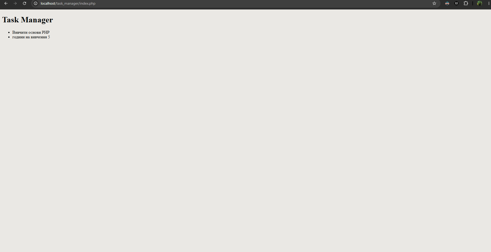

<?php
    $appName = "Task Manager";
    $taskTitle = "Вивчити основи PHP";
    $taskTimeEstimate = "години на вивчення 5"; // ціле число (очікуваний час на виконання в годинах)
?>
<!DOCTYPE html>
<html lang="en">
<head>
    <meta charset="UTF-8">
    <meta name="viewport" content="width=device-width, initial-scale=1.0">
    <title>Document</title>
</head>
<body>
    <header>
        <h1><?= $appName ?></h1>
    </header>
    <main>
        <ul>
            <li><?= $taskTitle ?></li>
            <li><?= $taskTimeEstimate ?></li>
        </ul>
    </main>
</body>
</html>

