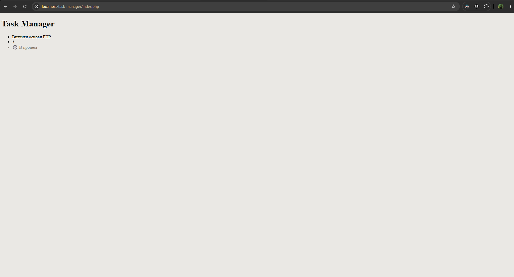

    <?php
        $isCompleted = false;
    ?>

    <li><?= $taskTitle ?></li>
    <li><?= $taskTimeEstimate ?></li>  
    <?php if ($isCompleted): ?>
        <li class="<?= $isCompleted ? 'task-done' : 'task-pending' ?>">✔️ Завдання виконано</li>
    <?php else: ?>
        <li class="<?= $isCompleted ? 'task-done' : 'task-pending' ?>">🕒 В процесі</li>
    <?php endif; ?>
            
